

  

  

  
  
  
  

 


 


 

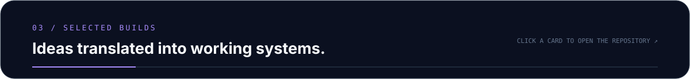

  <a href="https://github.com/mohitpandey32/internshala-search-page">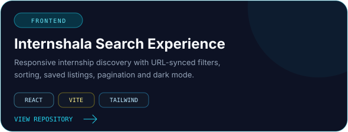</a>
  <a href="https://github.com/mohitpandey32/ai-job-scrapper">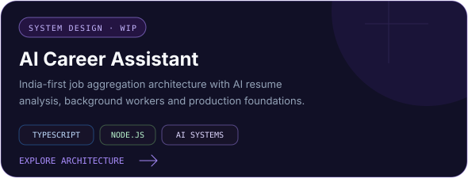</a>

  <a href="https://github.com/mohitpandey32/finance-dashboard">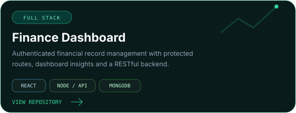</a>
  <a href="https://github.com/mohitpandey32/zenvix-digital">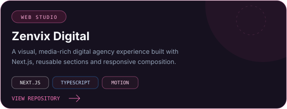</a>

 

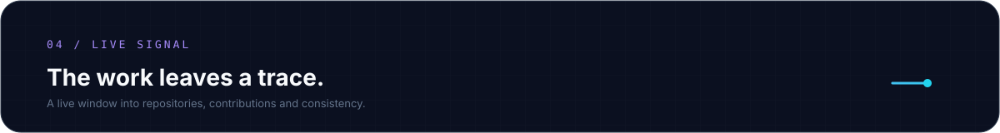

  

  

 

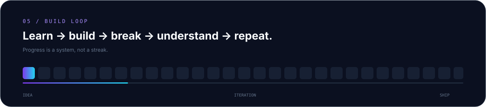

 

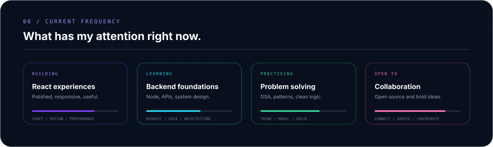

 

  
  

 

  Designed as a living interface · Built by <a href="https://github.com/mohitpandey32">Mohit Pandey</a>

